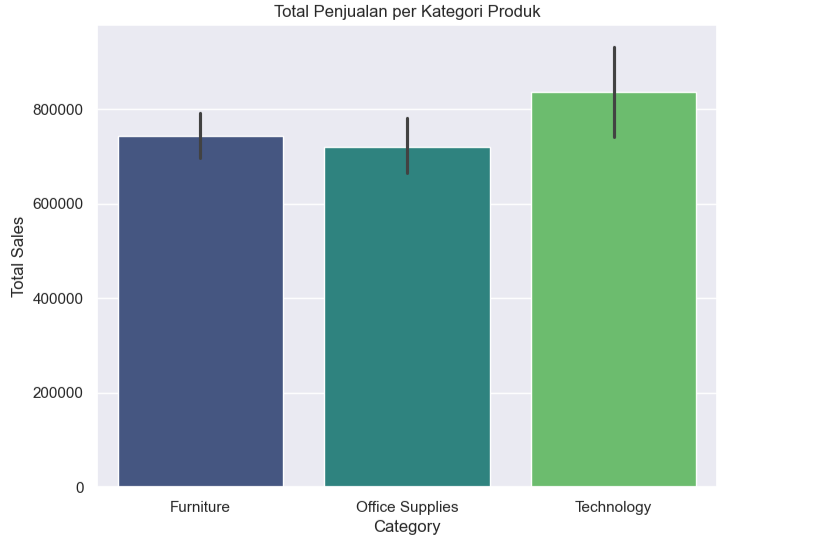

# 📊 Superstore Sales Analysis

Proyek ini berisi eksplorasi dan analisis data penjualan dari dataset Superstore. Analisis dilakukan menggunakan Python, dengan fokus untuk menemukan insight bisnis terkait produk, wilayah, tren penjualan, dan faktor-faktor yang memengaruhi profitabilitas.

---

## 📁 Struktur Project

dataset/ - Berisi dataset mentah (Superstore.csv)
notebook/ - Notebook Jupyter berisi analisis lengkap
images/ - Visualisasi atau hasil grafik (optional)
requirements.txt - Daftar library yang digunakan

---

## 🧰 Tools & Library

- Python
- pandas
- matplotlib
- seaborn
- Jupyter Notebook

---

## 🎯 Tujuan Analisis

✔️ Mengidentifikasi produk dan kategori paling laku  
✔️ Menganalisis profitabilitas berdasarkan wilayah  
✔️ Mendeteksi tren penjualan berdasarkan waktu  
✔️ Mengevaluasi dampak diskon terhadap profit  

---

## 📊 Contoh Visualisasi

**Total Penjualan per Kategori Produk**

---

## 💡 Insight Utama

- Produk **Technology** menjadi kontributor utama penjualan.
- Region **West** menghasilkan profit tertinggi.
- Pemberian diskon besar perlu dievaluasi karena berpotensi mengurangi profit.
- Terdapat pola musiman dalam tren penjualan.

---

## 📦 Dataset

Dataset berasal dari [Kaggle - Superstore Dataset](https://www.kaggle.com/datasets/vivek468/superstore-dataset-final).

---

## 🛠️ Cara Menjalankan

1. Clone repository ini
2. Install dependensi:

---

## 🧰 Tools & Library

- Python
- pandas
- matplotlib
- seaborn
- Jupyter Notebook

---

## 🎯 Tujuan Analisis

✔️ Mengidentifikasi produk dan kategori paling laku  
✔️ Menganalisis profitabilitas berdasarkan wilayah  
✔️ Mendeteksi tren penjualan berdasarkan waktu  
✔️ Mengevaluasi dampak diskon terhadap profit  

---

## 📊 Contoh Visualisasi

**Total Penjualan per Kategori Produk**

---

## 💡 Insight Utama

- Produk **Technology** menjadi kontributor utama penjualan.
- Region **West** menghasilkan profit tertinggi.
- Pemberian diskon besar perlu dievaluasi karena berpotensi mengurangi profit.
- Terdapat pola musiman dalam tren penjualan.

---

## 📦 Dataset

Dataset berasal dari [Kaggle - Superstore Dataset](https://www.kaggle.com/datasets/vivek468/superstore-dataset-final).

---

## 🛠️ Cara Menjalankan

1. Clone repository ini
2. Install dependensi:
    pip install -r requirements.txt
3. Buka Notebook di Jupyter:
4. Jalankan sel-sel di notebook.
